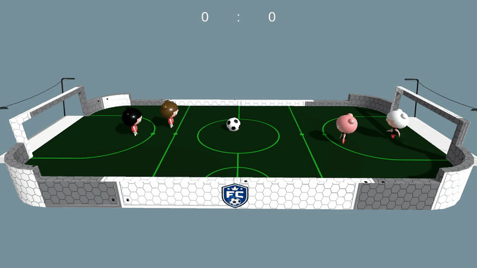

# Chibi Football Lab

Showcase of using Multi-Agent Reinforcement Learning (MARL) to train AI football players in a custom Unity environment using Unity's [ML-Agents Toolkit](https://github.com/Unity-Technologies/ml-agents).




**Related Projects:**
- [Chibi Football Arena](https://github.com/elarry/chibi-football-arena): Unity environment for training and simulating AI controlled football players.
- [Chibi Football Player](https://github.com/elarry/chibi-football-player): Player model and animation created using Blender.


## Structure

```
config/     — ML-Agents YAML training configs
models/     — trained model artifacts (.onnx)
notebooks/  — usage walkthrough notebooks
scripts/    — shell scripts for setup
```

## Setup

The simulation requires the Unity Chibi Football Arena environment. You have two possibilities:
1. Build [Chibi Football Arena](https://github.com/elarry/chibi-football-arena) with Unity from source files.
1. Download the pre-built environment from [releases](https://github.com/elarry/chibi-football-arena/releases). 


Run the bootstrap script to install all dependencies into a virtual environment:

```bash
./scripts/bootstrap.sh
source .venv/bin/activate
```

This pins Python 3.10.12 (required — ml-agents breaks on 3.11+), creates a `uv` venv at `.venv/`, clones the ML-Agents repo into `external/ml-agents/` as an editable install, and installs `onnxruntime` and `ipykernel`.


## Training

See [`notebooks/train-players.ipynb`](notebooks/train-players.ipynb) for a full walkthrough.

The basic training command:

```bash
mlagents-learn $CONFIG_PATH \
    --env=$UNITY_ENV \
    --run-id=$RUN_ID \
    --no-graphics
```

Useful flags:

| Flag | Description |
| --- | --- |
| `--num-envs 8` | Run 8 concurrent Unity instances for faster training |
| `--baseport 5006` | Use a different port when another training run is active |
| `--no-graphics` | Remove to watch training behavior in the Unity window |
| `--resume` | Resume from existing `$RUN_ID` (note: ELO resets to 1200) |
| `--force` | Overwrite results with the same `$RUN_ID` |
| `--initialize-from $PREV_ID` | Start from a previous run's weights |

Trained models and logs are saved under `results/$RUN_ID/`. Models are exported as `.onnx` files.

The `config/ma-poca-curriculum.yaml` config uses Curriculum Learning to first train agents to interact with the ball before playing against each other.


## Simulating Matches

See [`notebooks/simulate-match.ipynb`](notebooks/simulate-match.ipynb) for a full walkthrough. There are two ways to run inference:

### 1. `unity_inference.py` (Recommended)

Launches the Unity executable as a subprocess and passes ONNX models via `--mlagents-override-model-directory`. Inference runs on the C# side — no ML-Agents dependency needed at runtime.

Best for headless batch simulations, tournaments, and automated evaluation pipelines.

```python
result = unity_inference.simulate_match(
    models={"teamLeft": "models/example-model-A.onnx", "teamRight": "models/example-model-B.onnx"},
    env_path="env/MacOS/football-inference",
    results_dir="results",
    episode_limit=5,
    timeout_limit=20,
    save_video=True,
)
```

### 2. `mlagents_inference.py`

Connects to Unity via the ML-Agents Python API and runs ONNX inference using `onnxruntime`, sending actions back step-by-step.

Best when you need per-step telemetry (rewards, goal events), want to inspect or modify behavior mid-run, or are debugging a model.

```python
mlagents_inference.simulate_match(
    env_path="env/MacOS/football-inference",
    left_model_path="models/example-model-A.onnx",
    right_model_path="models/example-model-B.onnx",
)
```

### Comparison

| Feature | `unity_inference` | `mlagents_inference` |
| --- | --- | --- |
| Inference runs in | Unity (C#) | Python (onnxruntime) |
| Termination | Auto (episode/timeout limits) | Manual (Ctrl-C) |
| Observability | Low — post-hoc log parsing | High — per-step rewards and events |
| Speed | Faster | Slower (Python step loop overhead) |
| Video capture | Built-in (`--save-video`) | Not supported |
